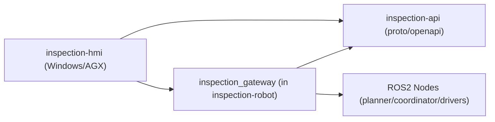

# inspection-api

大型工件视觉检测系统的通信协议仓库。  
该仓库只维护外部接口定义，不包含机器人控制逻辑。

## 1. 仓库定位

- 维护 `inspection_gateway` 对外协议（gRPC/OpenAPI）
- 作为 `inspection-hmi` 与 `inspection-robot` 的契约层
- 提供版本化接口，避免上位机与机器人服务端耦合

不负责：
- ROS2 节点实现
- 运动规划算法实现
- Qt UI 实现

## 2. 系统关系



## 3. V1 接口范围

V1 接口以“上位机效果”为导向，覆盖：工程配置、规划、执行控制、复合机械臂状态监测、取图与缺陷结果回显。

- `UploadCad`: 上传 CAD 模型文件，返回 `model_id`
- `SetInspectionTargets`: 提交检测点位（CAD 表面点 + 法线 + 相机拍摄角度）与拍摄配置（固定对焦距离等）
- `PlanInspection`: 请求联合规划，返回 `InspectionPath`
- `GetPlan`: 按 `plan_id` 获取规划结果（用于断点恢复/重连/多端查看）
- `StartInspection`: 启动任务
- `PauseInspection`: 暂停任务
- `ResumeInspection`: 恢复任务
- `StopInspection`: 停止任务
- `GetTaskStatus`: 查询任务状态
- `SubscribeSystemState` (stream): 订阅实时状态流
- `SubscribeInspectionEvents` (stream): 订阅执行事件、抓拍与缺陷结果
- `GetNavMap`: 获取导航地图元信息（用于 HMI 导航视图）
- `ListCaptures`: 按任务/点位列出抓拍记录与缺陷结构化结果（用于结果页与历史回看）
- `DownloadMedia` (stream): 下载二进制资源（抓拍图、地图图片等）

## 4. 数据模型建议

核心模型建议统一使用以下语义（字段以 `proto/inspection_gateway.proto` 为准）：

- `InspectionTarget`:
  - `surface.position/surface.normal`：CAD 表面点与法线（默认相机方向为 `-normal`）
  - `view.view_direction/roll_deg`：相机拍摄角度（对准方向 + 绕光轴旋转）
  - `CaptureConfig.focus_distance_m`：固定对焦距离（整条任务统一一个值）
- `InspectionPoint`:
  - `agv_pose(x,y,yaw in map)`
  - `arm_joint_goal[6]` (MoveJ 目标关节角)
  - （可选）`tcp_pose_goal` / `camera_pose`：用于 HMI 预览视锥/姿态叠加
  - `planning_cost`
- `InspectionPath`:
  - `waypoints[]`：规划输出的站位点序列（AGV 目标位姿 + 机械臂目标）
  - `estimated_distance_m`
  - `estimated_duration_s`
- `TaskStatus`（复合机械臂状态监测入口）:
  - `phase / progress_percent / current_action / error_message`
  - `agv.current_pose / agv.goal_pose / agv.(linear/angular)_velocity`
  - `arm.current_joints / arm.tcp_pose / arm.servo_enabled`
  - `current_waypoint_index / current_point_id`：用于 UI 高亮当前点位
- `InspectionEvent`（结果回显入口）:
  - `type=CAPTURED/DEFECT_FOUND`
  - `image: ImageRef{media.media_id,width,height,thumbnail_jpeg}`
  - `defects[]`：单张图的多缺陷结果（bbox/confidence/type）
- `NavMapInfo`:
  - `resolution_m_per_pixel / origin / image(ImageRef)`：用于 HMI 导航底图渲染

补充约定：

- HMI 的“路径折线”（导航预览）可直接由 `InspectionPath.waypoints[].agv_pose` 连接得到；如点位很多，仅用于显示时可下采样。
- `CaptureConfig.focus_distance_m` 与角度约束会进入规划/逆解约束；因此该配置在 V1 中被设计为“整条任务统一一个值”。
- `Pose2D{x,y,yaw}` 的 `frame_id` 默认使用 `map`（单位 m/rad）；若需要在导航底图上绘制，使用 `NavMapInfo.resolution_m_per_pixel + origin` 做 world->pixel 投影（公式见 proto 注释）。

## 5. 版本管理策略

- 采用语义化版本：`MAJOR.MINOR.PATCH`
- 协议破坏性变更：升级 `MAJOR`
- 新增字段且向后兼容：升级 `MINOR`
- 注释、文档或非行为修复：升级 `PATCH`

字段演进约束：
- Protobuf 字段号不可复用
- 删除字段先 `deprecated`，下一大版本移除
- 错误码保持稳定，不随小版本变更语义

## 6. 目录结构

```text
inspection-api/
├── proto/
│   └── inspection_gateway.proto
├── openapi/
└── README.md
```

说明：
- `proto/` 为主规范（推荐）
- `openapi/` 可作为 HTTP 网关镜像文档

## 7. 开发流程

1. 修改 `proto/inspection_gateway.proto`
2. 评审接口变更（请求/响应字段与错误码）
3. 更新版本号与变更记录
4. 通知 `inspection-hmi` 与 `inspection-robot` 同步升级

## 8. 近期任务

- 根据联调补齐“媒体资源访问”的实现约束（HTTP URL vs `DownloadMedia`）
- 明确点位级进度的语义（`current_waypoint_index` 与 `current_point_id` 的推进规则）
- 若需要把缺陷结果映射回 CAD（3D 标注），补齐 `camera_pose`/标定参数与坐标约定
