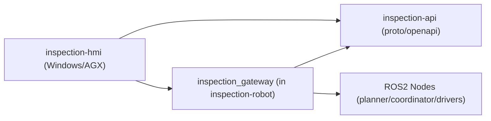

# inspection-api

大型工件视觉检测系统的通信协议仓库。  
该仓库只维护外部接口定义，不包含机器人控制逻辑。

## 1. 仓库定位

- 维护 `inspection_gateway` 对外协议（gRPC/OpenAPI）
- 作为 `inspection-hmi` 与 `inspection-robot` 的契约层
- 提供版本化接口，避免上位机与机器人服务端耦合

不负责：
- ROS2 节点实现
- 运动规划算法实现
- Qt UI 实现

## 2. 系统关系



## 3. V1 接口范围

建议第一版接口最小集合：

- `UploadCad`: 上传 CAD 模型文件，返回 `model_id`
- `SetInspectionRegions`: 提交刷选区域与视野参数
- `PlanInspection`: 请求联合规划，返回 `InspectionPath`
- `StartInspection`: 启动任务
- `PauseInspection`: 暂停任务
- `ResumeInspection`: 恢复任务
- `StopInspection`: 停止任务
- `GetTaskStatus`: 查询任务状态
- `SubscribeSystemState` (stream): 订阅实时状态流
- `SubscribeInspectionEvents` (stream): 订阅执行事件与告警

## 4. 数据模型建议

核心模型建议统一使用以下语义：

- `InspectionPoint`:
  - `agv_pose(x,y,yaw in map)`
  - `arm_joint_goal[6]` (MoveJ 目标关节角)
  - `planning_cost`
- `InspectionPath`:
  - `points[]`
  - `estimated_distance`
  - `estimated_duration`
- `AgvStatus`:
  - `arrived`
  - `stopped`
  - `current_pose`
  - `error_code`
- `SystemState`:
  - `phase`
  - `progress`
  - `current_action`
  - `error_message`

## 5. 版本管理策略

- 采用语义化版本：`MAJOR.MINOR.PATCH`
- 协议破坏性变更：升级 `MAJOR`
- 新增字段且向后兼容：升级 `MINOR`
- 注释、文档或非行为修复：升级 `PATCH`

字段演进约束：
- Protobuf 字段号不可复用
- 删除字段先 `deprecated`，下一大版本移除
- 错误码保持稳定，不随小版本变更语义

## 6. 目录结构

```text
inspection-api/
├── proto/
│   └── inspection_gateway.proto
├── openapi/
└── README.md
```

说明：
- `proto/` 为主规范（推荐）
- `openapi/` 可作为 HTTP 网关镜像文档

## 7. 开发流程

1. 修改 `proto/inspection_gateway.proto`
2. 评审接口变更（请求/响应字段与错误码）
3. 更新版本号与变更记录
4. 通知 `inspection-hmi` 与 `inspection-robot` 同步升级

## 8. 近期任务

- 补全 `inspection_gateway.proto` 的 V1 服务与消息定义
- 增加标准错误码（`OK/TIMEOUT/BUSY/INVALID_ARG/INTERNAL`）
- 补充鉴权字段预留（如 `token` 或 `client_id`）
